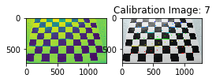
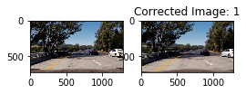
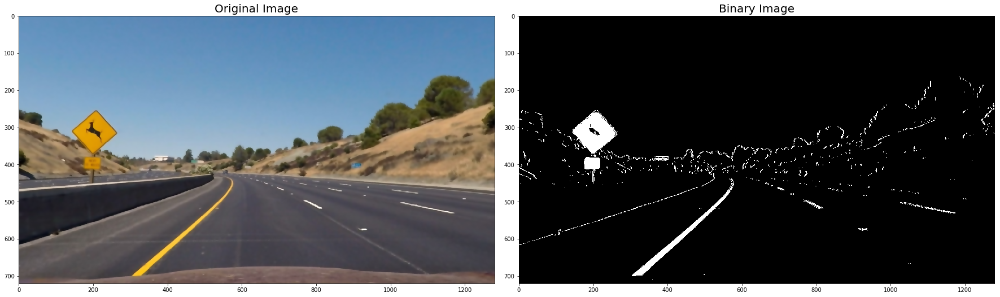
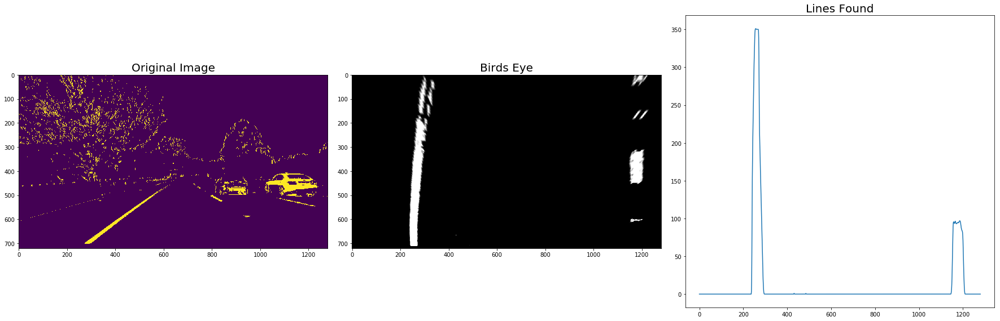
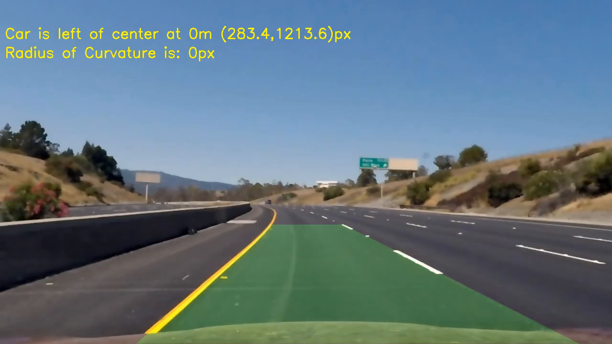

# **Advanced Lane Finding Project**

## The goals / steps of this project are the following:

Using common computer vision techniques, this project is to develop a pipeline that processes input video and determies
where lane lines are located and the current road lane for the vehicle's current position. In order to calculate the area of the lane that the vehicle is centered on, we need to indirectly calculate the location of the vehicle relative to the lane center and the radius of curvature of the lane.

The pipeline is as follows:

1. Compute the camera calibration matrix and distortion coefficients (intrinsics) given a set of chessboard images.
2. Apply a distortion correction to binary images.
3. Use color transforms, gradients, etc., to create a thresholded binary image.
4. Apply a perspective transform to rectify binary image ("birds-eye view").
5. Detect lane pixels and fit to find the lane boundary.
6. Determine the curvature of the lane and vehicle position with respect to center.
7. Warp the detected lane boundaries back onto the original image.
8. Output visual display of the lane boundaries and numerical estimation of lane curvature and vehicle position.

[//]: # (Image References)

[image1]: ./examples/undistort_output.png "Undistorted"
[image2]: ./test_images/test1.jpg "Road Transformed"
[image3]: ./examples/binary_combo_example.jpg "Binary Example"
[image4]: ./examples/warped_straight_lines.jpg "Warp Example"
[image5]: ./examples/color_fit_lines.jpg "Fit Visual"
[image6]: ./examples/example_output.jpg "Output"
[video1]: ./project_video.mp4 "Video"

### Pipeline (video frames aka single images)

####(1) Compute the camera calibration matrix and distortion coefficients (intrinsics) given a set of chessboard images.

This step we start the pipeline by calibration of the camera to correct for lens distortion. This provides us a proper flat projection for our 2D computer vision tasks, aka the pixel to distance (meters) values are linear across the image.

We perform this using the standard chessboard technique, using an image of a chessboard with known spacing and size, finding the corners of the chessboard from different angles to develop the camera parameters allowing us to convert 2D distorted sensor measurements to a 2D image that properly represents the 3D world. More on camera calibration can be found [here](https://en.wikipedia.org/wiki/Chessboard_detection)

OpenCV has conveience method(s) to perform calibration, 'cv2.findChessboardCorners()'. We can also confirm the results by drawing the corners via cv2.drawChessboardCorners(). We take all the calibration images supplied and run findChessboardCorners on all of them to find their repective corners, then apply that vector of values to the opencv command: calibrateCamera() and develop a distortion matrix. For example we undistort an image from the test dataset:

*Original Image and Location of Chess Corners and Drawn Lines*

We take the derived distortion matrix and apply it to a video frame using the cv2.undistort() command:

*Distorted Image and UNistorted Image*

At the end of this step, in processing a video stream, I would have one **un**distorted video frame.

####(2) Apply a distortion correction to binary images and (3) Use color transforms, gradients, etc., to create a thresholded binary image.

Now we use the undistorted image and create a binary image to reduce processing error and speed up processing in finding lane lines. Here, we take the undistored image and apply our to_binary_sobel() function, which converts the image to HLS colorspace, runs a sobel filter against it (canny edge detection), applies a gradient function that rejects edges that aren't part of a line, and applies a color threshold on white and yellow lines to create a binary-color image. 

*UNdistorted Image and Combined Binary Image*

At the end of this step, in processing a video stream, I would have one corrected, binary video frame. A vlack-n-white image containing the S channel from the HLS image, 'yellow' channel and white channel from the RGB image and the gradient pixels from applying a sobel filter.

####(4) Apply a perspective transform to rectify binary image ("birds-eye view").

Having a bird-eye view, aka looking down, turns the 3D world representation of the image to a flat 2D perspective, which is much easier to detect lines (lines are 2D!). We assume the road is fairly flat and level plane, so having a looking-down view should have the lane lines appear parallel (easy to detect!). We apply a perspective transform on the image to create a bird-eye view of the image--in order words, designating a trapazoid in the image that contains the lines and warping it.

*Original Image and Bird's Eye View, Warped Image*

At the end of this step, in processing a video stream, I would have one bird's eye view (warped) video frame.

####(5) Detect lane pixels and fit to find the lane boundary.

In a bird's eye view image, we can run a histrogram against the binary image and the higher counts indicate where the lines are located (as a cluster of points aka peaks).

*Bird's Eye View, histrogram detecting where the connected lines are*

We can use the histrogram to detect the lane positions in the image (across the X direction or perpendicular to the travel direction). We use all the points around the peaks of the image histogram (using max() and nonzero() functions). After finding the lane lines, we use them to fit a continuous line (polyfit()), that will be used to determine a lane boundary.

*Lane line detected and line fitted on warped color image*

At the end of this step, in processing a video stream, I would have 
* lane lines detected and 
* a virtual continuous line displayed over the lane lines in one bird's eye view (warped) video frame.

####(6) Determine the curvature of the lane and vehicle position with respect to center and (7) Warp the detected lane boundaries back onto the original image and (8) Output visual display of the lane boundaries and numerical estimation of lane curvature and vehicle position.

Taking the warped image with continuous lines drawn on it denoting the lanes, we need to find the actual lanes. Basically, the fitted/continuous line is where we 'think' the actual lane is located in the image. Thus, we need to search the pixels around these lines for the true lane locations (a cluster of points in the binary image). We find the pixel positions of the true lane lines, and run polyfit() to help determine the actual lane boundary. The actual lane positions imply a lane boundary: we can fit a polygon to that boundary.

*Lines estimating where the actual lane boundary is located via histogram analysis, search area to identify lane-line pixels in the image and resulting un-warped image showing the lane boundary.*

We now have a polygon that identifies the lane in bird's eye view. We need to convert it back to the un-warped view. To unwarp the polygon, we need to find its location with respect to the center of the vehicle (view point) as well as the radius of curvature of the boundaries in bird's eye view. We convert the pixels to meters using [US road standards](http://onlinemanuals.txdot.gov/txdotmanuals/rdw/horizontal_alignment.htm#BGBHGEGC) and fitting the [curves to a circle](https://www.intmath.com/applications-differentiation/8-radius-curvature.php) in determining the curvature of the road.

*Fitted lane boundary and calculated centerline offset of the vehicle and curvature of the lane*

At the end of this step, in processing a video stream, I would have a polygon denoting the lane the vehicle is located in an unwarped color frame, it's postion w.r.t. the center line and radius of curvature.

### Pipeline (video)

We take the above pipeline and run a video against it by passing individual frames. We attempt to run the sliding window approach as in Lesson 33, to speed up the lane-line detecting process. This is by looking at the "lane start position" (in the histogram) and seeing if the next frame's histogram result puts the lane start position in a similar range.

### Discussion

#### 1. Briefly discuss any problems / issues you faced in your implementation of this project.  Where will your pipeline likely fail?  What could you do to make it more robust?

* Road surface/Lane-line color: asphalt and concrete create situations that the binary conversion cannot handle robustly. If you can't see yellow or white (shadows), well you can't see the lane lines...

* Scene lighting: Could effect detection of white and yellow lines, either by creating false positives or no detection of lines at all. Shadows caused lines to not be detected. For example, this would not work at night.
* Environment & weather: We are totally reliant on a camera-vision system, and optical occusions would cause this to fail. This would not work in inclement weather.
* Elevation chanegs: Since we are making a assumption that the road is fairly flat after warping, this maybe incorrect if the road itself has dips and rises within a single frame.
* Changing lanes, It's very possible this pipeline could mis-interpret left or right lanes by reversing them as you change lanes. You could also miss white lanes markers as you cross between lines.

To make this pipeline more robust:
* Apply the deep learning approach used in Project 3 to determine lane center and compare the center of the vehicle from this pipeline. Also compare steering angle from Project 3 with radius of curvature of this pipeline.
* Possible augment data by creating left and right views of the video frames to provide other possible outcomes of this pipeline to compare against.
* In addition to using Canny edge detection, ground plane detection via plane estimation and color segmentation from a monocular camera maybe used to perform background subtraction (reduce false positives).
* Higher resolution, longer camera views.
* Infrared cameras or active stereo cameras like a Stereolabs ZED or Intel Realsense to solve the shadow issue.
